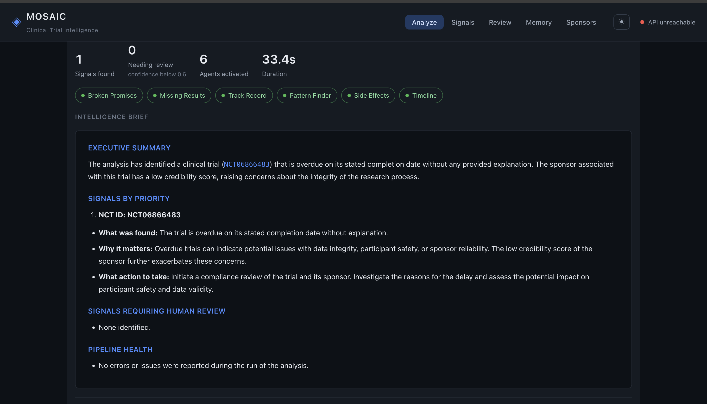

# 🤖 Multi-AI Agent

<p align="center">
  
</p>

<h3 align="center">
  An intelligent multi-agent AI platform for analysis, reasoning, memory, research, and automated task execution.
</h3>

<p align="center">
  
  
  
  
  
</p>

---

## 🌐 Overview

**Multi-AI Agent** is an intelligent AI-agent platform designed to coordinate multiple specialized agents to handle complex tasks through a unified workflow.

Instead of relying on a single AI model for every task, the platform follows a modular agent-based architecture where specialized components can analyze information, identify patterns, maintain memory, process documents, evaluate results, and support decision-making.

The system is designed with extensibility in mind, allowing new agents, tools, data sources, and workflows to be integrated as the platform evolves.

---

## ✨ Key Features

| Feature                         | Description                                                                  |
| ------------------------------- | ---------------------------------------------------------------------------- |
| 🤖 **Multi-Agent Architecture** | Multiple specialized AI agents work together to process complex tasks.       |
| 🧠 **AI Memory**                | Maintains and manages contextual information for intelligent workflows.      |
| 🔍 **Analysis Engine**          | Performs structured analysis and extracts meaningful insights from data.     |
| 📊 **Pattern Detection**        | Identifies relevant patterns and relationships within processed information. |
| 📄 **Document Processing**      | Supports document parsing and information extraction workflows.              |
| 🔬 **Research & Exploration**   | Designed to support research-oriented AI workflows and investigation.        |
| 🔄 **Agent Orchestration**      | Coordinates different agents according to the task and workflow.             |
| 👨‍💻 **Human-in-the-Loop**     | Supports human intervention where review or approval is required.            |
| 📈 **Evaluation & Monitoring**  | Provides mechanisms for evaluating agent decisions and system behaviour.     |
| ☁️ **Cloud Ready**              | Includes deployment configuration for scalable environments.                 |
| 🐳 **Docker Support**           | Containerized deployment support for consistent environments.                |

---

## 🧠 How It Works

```text
                    ┌─────────────────────┐
                    │       USER          │
                    │      REQUEST        │
                    └──────────┬──────────┘
                               │
                               ▼
                    ┌─────────────────────┐
                    │   AI ORCHESTRATOR   │
                    │  Task Understanding │
                    └──────────┬──────────┘
                               │
              ┌────────────────┼────────────────┐
              ▼                ▼                ▼
       ┌─────────────┐  ┌─────────────┐  ┌─────────────┐
       │  Analysis   │  │   Pattern   │  │  Research   │
       │    Agent    │  │   Finder    │  │    Agent    │
       └──────┬──────┘  └──────┬──────┘  └──────┬──────┘
              │                │                │
              └────────────────┼────────────────┘
                               ▼
                    ┌─────────────────────┐
                    │   MEMORY SYSTEM     │
                    │ Context & Knowledge │
                    └──────────┬──────────┘
                               │
                               ▼
                    ┌─────────────────────┐
                    │ REVIEW / EVALUATION │
                    └──────────┬──────────┘
                               │
                               ▼
                    ┌─────────────────────┐
                    │    FINAL RESULT     │
                    └─────────────────────┘
```

---

## 🖥️ Application Preview

### Main Dashboard

<p align="center">
  
</p>

---

## 📸 Interface

The platform includes dedicated views for different stages of the AI workflow.

### 🔎 Analysis

<p align="center">
  
</p>

Designed to provide structured analysis and meaningful insights from processed information.

### 🧠 Memory

<p align="center">
  
</p>

The memory layer helps the system maintain contextual information across AI workflows.

### 🔬 Review & Evaluation

<p align="center">
  
</p>

Provides a dedicated stage for reviewing and evaluating generated results.

> **Note:** Replace the repeated `Screenshot.png` references above with individual screenshots when you add them to the repository, for example:
>
> `screenshots/dashboard.png`
> `screenshots/analysis.png`
> `screenshots/memory.png`
> `screenshots/review.png`

---

## 🏗️ Project Architecture

The project combines AI-agent logic, memory systems, data processing, evaluation components, and a web interface.

```text
Multi-AI-Agent/
│
├── 🤖 AI Agents
│   ├── analysis.py
│   ├── pattern_finder_agent.py
│   ├── broken_promises_agent.py
│   └── missing_results_agent.py
│
├── 🧠 Memory
│   ├── memory.py
│   ├── episodic_store.py
│   ├── procedural_store.py
│   └── backblaze_store.py
│
├── 📄 Data & Documents
│   ├── document_parser.py
│   ├── chunker.py
│   └── embedder.py
│
├── 🔗 Agent Workflow
│   ├── graph_builder.py
│   ├── dependencies.py
│   └── hitl.py
│
├── 🖥️ Frontend
│   ├── AnalyzeView.tsx
│   ├── MemoryView.tsx
│   ├── ReviewView.tsx
│   ├── SignalsView.tsx
│   └── SponsorsView.tsx
│
├── 🐳 Deployment
│   ├── Dockerfile
│   ├── cloud_run.yaml
│   └── deploy.sh
│
└── 📚 Documentation
    ├── README.md
    ├── protocol_v1.md
    └── protocol_v2.md
```

The repository currently contains these agent, memory, document-processing, orchestration, frontend, and deployment components.

---

## ⚙️ Core Components

### 🤖 Agent Layer

Specialized agents are responsible for different reasoning and analysis tasks. This modular approach makes it possible to add or modify agents without redesigning the entire application.

### 🧠 Memory Layer

The platform includes multiple memory-related components for storing and retrieving information required by AI workflows.

### 📊 Analysis Layer

The analysis pipeline processes available information and produces structured insights that can be consumed by other agents.

### 🔗 Graph-Based Workflow

The workflow layer coordinates different components and enables structured execution between agents.

### 👨‍💻 Human-in-the-Loop

Certain workflows can incorporate human review or intervention when automated decisions require additional validation.

---

## 🛠️ Technology Stack

<p align="center">

| Category             | Technology                         |
| -------------------- | ---------------------------------- |
| **Programming**      | Python                             |
| **Frontend**         | React / TypeScript                 |
| **AI & Agents**      | Python-based AI agent architecture |
| **Data Processing**  | CSV / Document Processing          |
| **Memory**           | Modular Memory Stores              |
| **Containerization** | Docker                             |
| **Deployment**       | Cloud Run configuration            |
| **Development**      | VS Code / Git                      |
| **Documentation**    | Markdown                           |

</p>

---

## 🚀 Getting Started

### 1️⃣ Clone the Repository

```bash
git clone https://github.com/astervijay63-cpu/Multi-AI-Agent.git
cd Multi-AI-Agent
```

### 2️⃣ Create a Virtual Environment

```bash
python -m venv venv
```

### Windows

```bash
venv\Scripts\activate
```

### Linux / macOS

```bash
source venv/bin/activate
```

### 3️⃣ Install Dependencies

Install the required Python dependencies according to the project's dependency configuration.

```bash
pip install -r requirements.txt
```

If the project uses a different dependency setup, follow the instructions provided in the repository configuration.

### 4️⃣ Configure Environment Variables

Create a `.env` file based on the provided example:

```bash
cp .env.example .env
```

Add the required API keys and configuration values.

> ⚠️ Never commit API keys, passwords, tokens, or other secrets to GitHub.

### 5️⃣ Run the Application

Use the project's main application entry point or configured frontend/backend commands.

```bash
python main.py
```

---

## 🐳 Docker

Build the Docker image:

```bash
docker build -t multi-ai-agent .
```

Run the container:

```bash
docker run -p 8080:8080 multi-ai-agent
```

---

## 📊 Project Workflow

```text
User Request
     │
     ▼
Task Understanding
     │
     ▼
Agent Selection
     │
     ├───────────────┐
     ▼               ▼
Analysis Agent   Research Agent
     │               │
     └───────┬───────┘
             ▼
       Memory / Context
             │
             ▼
       Result Evaluation
             │
             ▼
       Human Review
             │
             ▼
        Final Output
```

---

## 🔐 Security Considerations

Security should be considered throughout the deployment and operation of an AI-agent system.

Recommended practices include:

* 🔒 Store secrets using environment variables or secure secret managers.
* 🚫 Never expose API keys in source code.
* 🛡️ Validate external inputs before processing.
* 🧹 Avoid storing unnecessary sensitive information.
* 🔍 Monitor agent actions and tool usage.
* 📋 Maintain appropriate logs for debugging and auditing.
* 🔐 Apply least-privilege permissions to external services.

---

## 🗺️ Roadmap

### Phase 1 — Foundation

* [x] Multi-agent architecture
* [x] Analysis workflows
* [x] Memory components
* [x] Web interface
* [x] Docker support

### Phase 2 — Intelligence

* [ ] Advanced agent coordination
* [ ] Improved long-term memory
* [ ] More specialized agents
* [ ] Enhanced reasoning workflows
* [ ] Advanced evaluation metrics

### Phase 3 — Production

* [ ] Authentication & authorization
* [ ] Scalable cloud deployment
* [ ] Observability dashboard
* [ ] Advanced security controls
* [ ] Automated testing and CI/CD

### Phase 4 — Ecosystem

* [ ] Plugin/tool architecture
* [ ] External API integrations
* [ ] Agent marketplace concept
* [ ] Multi-user collaboration
* [ ] Enterprise deployment support

---

## 📈 Future Vision

The long-term goal of **Multi-AI Agent** is to evolve from a collection of AI agents into an extensible intelligent-agent ecosystem capable of coordinating specialized AI workers, tools, memory, and human oversight.

```text
                 ┌──────────────────────┐
                 │    MULTI-AI AGENT    │
                 │     ECOSYSTEM        │
                 └──────────┬───────────┘
                            │
       ┌────────────────────┼────────────────────┐
       ▼                    ▼                    ▼
   AI AGENTS             MEMORY               TOOLS
       │                    │                    │
       └────────────────────┼────────────────────┘
                            ▼
                    INTELLIGENT WORKFLOW
                            │
                            ▼
                     HUMAN OVERSIGHT
                            │
                            ▼
                    TRUSTED AI OUTPUT
```

---

## 🤝 Contributing

Contributions, ideas, improvements, and feedback are welcome.

1. Fork the repository.
2. Create a feature branch.
3. Implement your changes.
4. Test the changes.
5. Commit your work.
6. Push the branch.
7. Open a Pull Request.

---

## 📄 License

This project is distributed under the **CC BY 4.0** license.

See the `LICENSE` file for details.

---

## ⭐ Support the Project

If you find this project useful or interesting:

⭐ **Star the repository**
🍴 **Fork the project**
🐛 **Report issues**
💡 **Suggest improvements**
🤝 **Contribute to the project**

---

## 👨‍💻 Author

**Aster Vijay**

Building intelligent systems at the intersection of **Artificial Intelligence, Multi-Agent Systems, Automation, and Software Engineering.**

---

<p align="center">
  <b>🤖 Build. Orchestrate. Analyze. Evolve.</b>
</p>

<p align="center">
  Made with ❤️ using AI & modern software engineering.
</p>
